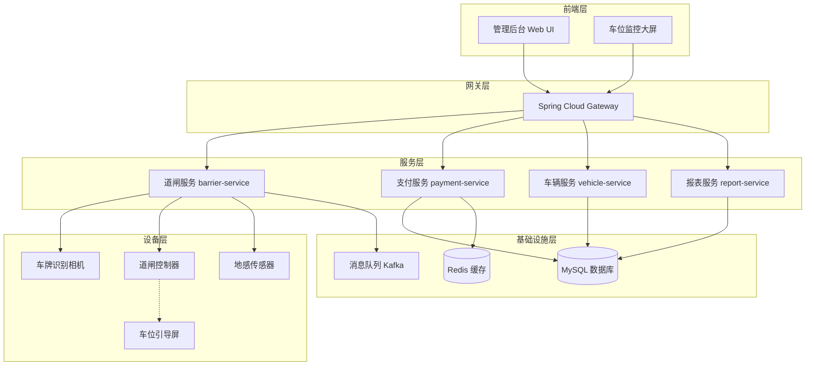
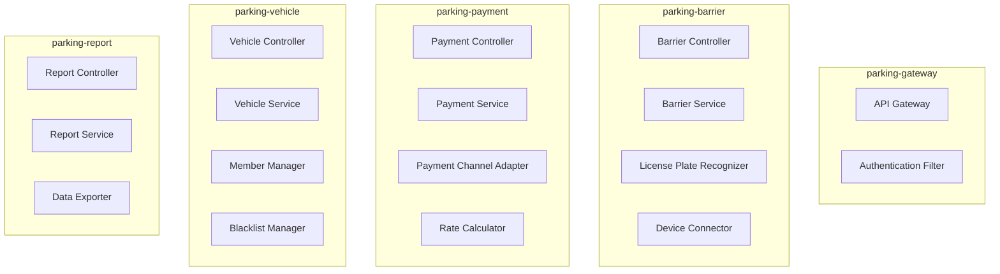
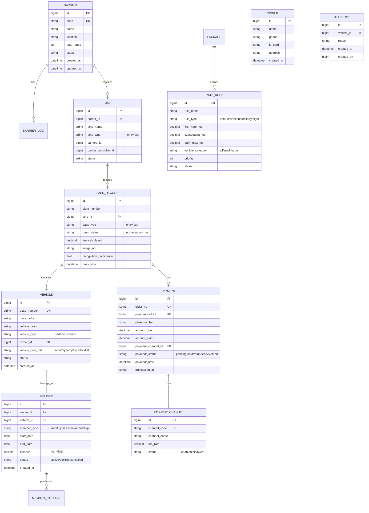
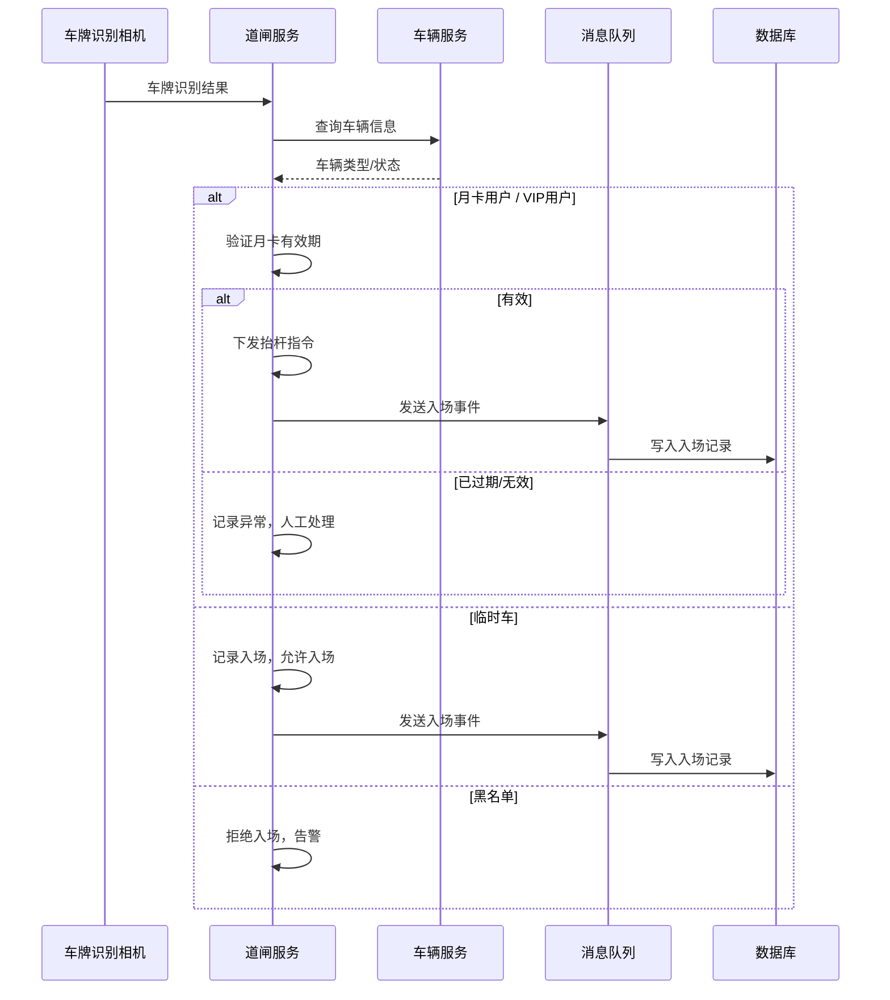
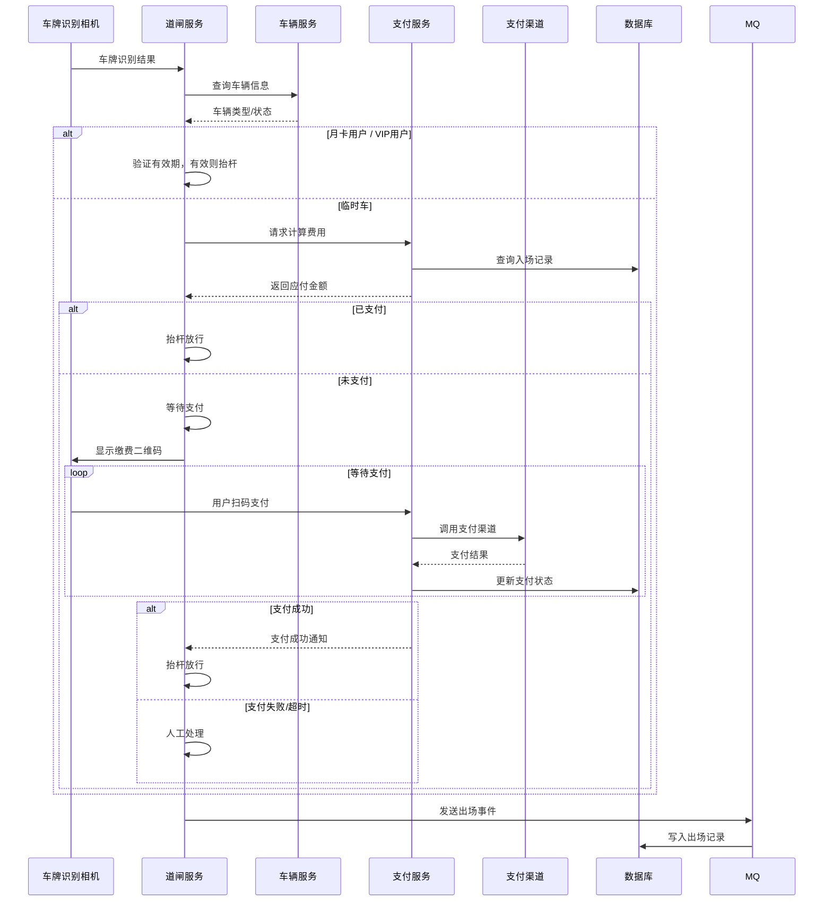
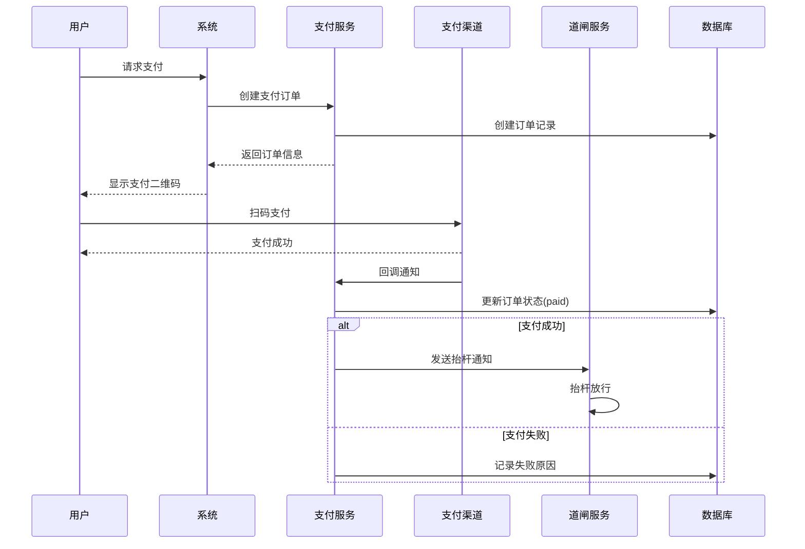

# 停车场管理系统技术设计规格

## 1. 概述

### 1.1 项目信息

| 属性 | 值 |
|------|-----|
| 项目名称 | Parking Management System |
| 项目代号 | parking-management-system |
| 版本号 | 1.0.0 |
| 创建日期 | 2026-03-27 |
| 技术栈 | Java Spring Boot + Vue 3 + MySQL |

### 1.2 系统架构图



### 1.3 系统组件图



## 2. 技术架构

### 2.1 整体架构

系统采用前后分离架构，后端基于 Spring Boot 微服务框架构建，前端使用 Vue 3 + Element Plus。

```
┌─────────────────────────────────────────────────────────────┐
│                        Client Layer                         │
│              (Vue 3 + Element Plus + Axios)                 │
└─────────────────────────────────────────────────────────────┘
                              │
                              ▼
┌─────────────────────────────────────────────────────────────┐
│                     API Gateway Layer                        │
│               (Spring Cloud Gateway)                         │
│              [Authentication / Authorization]                │
└─────────────────────────────────────────────────────────────┘
                              │
        ┌─────────────────────┼─────────────────────┐
        ▼                     ▼                     ▼
┌───────────────┐    ┌───────────────┐    ┌───────────────┐
│ barrier-service│    │payment-service│    │vehicle-service│
│   :8081       │    │   :8082      │    │   :8083       │
└───────────────┘    └───────────────┘    └───────────────┘
        │                     │                     │
        └─────────────────────┼─────────────────────┘
                              ▼
┌─────────────────────────────────────────────────────────────┐
│                      Data Layer                              │
│            (MySQL 8.0 + Redis 7.0)                          │
└─────────────────────────────────────────────────────────────┘
```

### 2.2 技术选型

| 组件 | 技术选型 | 说明 |
|------|----------|------|
| 后端框架 | Spring Boot 3.2 | Java 17+ |
| 微服务网关 | Spring Cloud Gateway 2023 | API路由、过滤器 |
| 数据库 | MySQL 8.0 | 主数据存储 |
| 缓存 | Redis 7.0 | Session缓存、实时数据 |
| 消息队列 | Apache Kafka | 设备事件异步处理 |
| ORM | MyBatis-Plus 3.5 | 数据库访问层 |
| 前端框架 | Vue 3.4 | Composition API |
| UI组件库 | Element Plus 2.5 | 后台管理组件 |
| 构建工具 | Maven 3.9 / Vite 5 | 后端/前端构建 |
| 容器化 | Docker + Docker Compose | 开发部署 |

### 2.3 项目模块结构

```
parking-management-system/
├── parking-gateway/              # API网关服务
├── parking-barrier/              # 道闸控制服务
├── parking-payment/              # 支付服务
├── parking-vehicle/              # 车辆管理服务
├── parking-report/               # 报表服务
├── parking-common/               # 公共模块
│   ├── parking-common-core/      # 核心工具类
│   ├── parking-common-database/  # 数据库公共组件
│   └── parking-common-redis/     # Redis公共组件
└── parking-web/                  # 前端管理后台
```

## 3. 数据模型

### 3.1 核心实体



### 3.2 数据库表结构

#### 表：barrier（道闸设备表）

| 字段名 | 类型 | 约束 | 说明 |
|--------|------|------|------|
| id | BIGINT | PK, AUTO_INCREMENT | 主键 |
| code | VARCHAR(32) | UNIQUE, NOT NULL | 设备编码 |
| name | VARCHAR(64) | NOT NULL | 设备名称 |
| location | VARCHAR(128) | | 安装位置描述 |
| total_lanes | INT | DEFAULT 1 | 车道数量 |
| status | VARCHAR(16) | NOT NULL | online/offline/fault |
| raise_timeout | INT | DEFAULT 10 | 抬杆超时秒数 |
| created_at | DATETIME | NOT NULL | 创建时间 |
| updated_at | DATETIME | NOT NULL | 更新时间 |

#### 表：lane（车道表）

| 字段名 | 类型 | 约束 | 说明 |
|--------|------|------|------|
| id | BIGINT | PK, AUTO_INCREMENT | 主键 |
| barrier_id | BIGINT | FK | 所属道闸ID |
| lane_name | VARCHAR(32) | NOT NULL | 车道名称 |
| lane_type | VARCHAR(16) | NOT NULL | entry(入口)/exit(出口) |
| camera_id | VARCHAR(64) | | 相机设备ID |
| barrier_controller_id | VARCHAR(64) | | 道闸控制器ID |
| status | VARCHAR(16) | NOT NULL | normal/maintenance/fault |

#### 表：pass_record（通行记录表）

| 字段名 | 类型 | 约束 | 说明 |
|--------|------|------|------|
| id | BIGINT | PK, AUTO_INCREMENT | 主键 |
| plate_number | VARCHAR(16) | NOT NULL, INDEX | 车牌号 |
| lane_id | BIGINT | FK, INDEX | 车道ID |
| pass_type | VARCHAR(16) | NOT NULL | entry/exit |
| pass_status | VARCHAR(16) | NOT NULL | normal/abnormal |
| recognition_confidence | DECIMAL(5,4) | | 识别置信度 |
| image_url | VARCHAR(256) | | 抓拍图片URL |
| fee_calculated | DECIMAL(10,2) | | 计算费用 |
| pass_time | DATETIME | NOT NULL, INDEX | 通行时间 |
| created_at | DATETIME | NOT NULL | 创建时间 |

#### 表：payment（支付记录表）

| 字段名 | 类型 | 约束 | 说明 |
|--------|------|------|------|
| id | BIGINT | PK, AUTO_INCREMENT | 主键 |
| order_no | VARCHAR(32) | UNIQUE, NOT NULL | 订单号 |
| pass_record_id | BIGINT | FK | 关联通行记录 |
| plate_number | VARCHAR(16) | NOT NULL, INDEX | 车牌号 |
| amount_due | DECIMAL(10,2) | NOT NULL | 应付金额 |
| amount_paid | DECIMAL(10,2) | NOT NULL | 实付金额 |
| payment_channel_id | BIGINT | FK | 支付渠道ID |
| payment_status | VARCHAR(16) | NOT NULL | pending/paid/refunded/reversed |
| payment_time | DATETIME | | 支付时间 |
| transaction_id | VARCHAR(64) | | 第三方交易号 |
| created_at | DATETIME | NOT NULL | 创建时间 |

#### 表：payment_channel（支付渠道表）

| 字段名 | 类型 | 约束 | 说明 |
|--------|------|------|------|
| id | BIGINT | PK, AUTO_INCREMENT | 主键 |
| channel_code | VARCHAR(32) | UNIQUE, NOT NULL | 渠道编码 |
| channel_name | VARCHAR(64) | NOT NULL | 渠道名称 |
| fee_rate | DECIMAL(5,4) | DEFAULT 0 | 手续费率 |
| status | VARCHAR(16) | NOT NULL | enabled/disabled |
| sort_order | INT | DEFAULT 0 | 排序 |

#### 表：rate_rule（费率规则表）

| 字段名 | 类型 | 约束 | 说明 |
|--------|------|------|------|
| id | BIGINT | PK, AUTO_INCREMENT | 主键 |
| rule_name | VARCHAR(64) | NOT NULL | 规则名称 |
| rule_type | VARCHAR(16) | NOT NULL | default/weekend/holiday/night |
| first_hour_fee | DECIMAL(10,2) | NOT NULL | 首小时费用 |
| subsequent_fee | DECIMAL(10,2) | NOT NULL | 续费费用 |
| daily_max_fee | DECIMAL(10,2) | | 24小时封顶 |
| vehicle_category | VARCHAR(16) | DEFAULT 'all' | 适用车型 |
| priority | INT | DEFAULT 0 | 优先级 |
| status | VARCHAR(16) | NOT NULL | active/inactive |

## 4. API 接口设计

### 4.1 道闸服务 API

#### 4.1.1 道闸设备管理

| 接口 | 方法 | 路径 | 说明 |
|------|------|------|------|
| 设备注册 | POST | /api/barrier/v1/devices | 注册道闸设备 |
| 设备列表 | GET | /api/barrier/v1/devices | 获取设备列表 |
| 设备详情 | GET | /api/barrier/v1/devices/{id} | 获取设备详情 |
| 设备更新 | PUT | /api/barrier/v1/devices/{id} | 更新设备信息 |
| 设备删除 | DELETE | /api/barrier/v1/devices/{id} | 删除设备 |

#### 4.1.2 道闸控制

| 接口 | 方法 | 路径 | 说明 |
|------|------|------|------|
| 抬杆 | POST | /api/barrier/v1/control/raise | 抬起道闸 |
| 落杆 | POST | /api/barrier/v1/control/lower | 落下道闸 |
| 查询状态 | GET | /api/barrier/v1/control/status/{laneId} | 查询车道状态 |

### 4.2 支付服务 API

#### 4.2.1 支付渠道管理

| 接口 | 方法 | 路径 | 说明 |
|------|------|------|------|
| 创建渠道 | POST | /api/payment/v1/channels | 创建支付渠道 |
| 渠道列表 | GET | /api/payment/v1/channels | 获取渠道列表 |
| 渠道更新 | PUT | /api/payment/v1/channels/{id} | 更新渠道 |
| 渠道删除 | DELETE | /api/payment/v1/channels/{id} | 删除渠道 |

#### 4.2.2 支付交易

| 接口 | 方法 | 路径 | 说明 |
|------|------|------|------|
| 计算费用 | POST | /api/payment/v1/calculate | 计算停车费用 |
| 创建订单 | POST | /api/payment/v1/orders | 创建支付订单 |
| 查询订单 | GET | /api/payment/v1/orders/{orderNo} | 查询订单状态 |
| 取消订单 | POST | /api/payment/v1/orders/{orderNo}/cancel | 取消订单 |
| 冲正订单 | POST | /api/payment/v1/orders/{orderNo}/reverse | 冲正订单 |
| 回调通知 | POST | /api/payment/v1/callback/{channel} | 支付回调 |

### 4.3 车辆服务 API

#### 4.3.1 车辆管理

| 接口 | 方法 | 路径 | 说明 |
|------|------|------|------|
| 车辆注册 | POST | /api/vehicle/v1/vehicles | 注册车辆 |
| 车辆列表 | GET | /api/vehicle/v1/vehicles | 获取车辆列表 |
| 车辆详情 | GET | /api/vehicle/v1/vehicles/{id} | 获取车辆详情 |
| 车辆更新 | PUT | /api/vehicle/v1/vehicles/{id} | 更新车辆 |
| 批量导入 | POST | /api/vehicle/v1/vehicles/import | 批量导入 |

#### 4.3.2 月卡管理

| 接口 | 方法 | 路径 | 说明 |
|------|------|------|------|
| 开通月卡 | POST | /api/vehicle/v1/members | 开通月卡 |
| 月卡列表 | GET | /api/vehicle/v1/members | 获取月卡列表 |
| 月卡续期 | POST | /api/vehicle/v1/members/{id}/renew | 月卡续期 |
| 月卡详情 | GET | /api/vehicle/v1/members/{id} | 月卡详情 |

#### 4.3.3 黑名单管理

| 接口 | 方法 | 路径 | 说明 |
|------|------|------|------|
| 加入黑名单 | POST | /api/vehicle/v1/blacklist | 加入黑名单 |
| 黑名单列表 | GET | /api/vehicle/v1/blacklist | 获取黑名单 |
| 移出黑名单 | DELETE | /api/vehicle/v1/blacklist/{id} | 移出黑名单 |

### 4.4 报表服务 API

| 接口 | 方法 | 路径 | 说明 |
|------|------|------|------|
| 通行记录查询 | GET | /api/report/v1/pass-records | 查询通行记录 |
| 导出通行记录 | GET | /api/report/v1/pass-records/export | 导出通行记录 |
| 收费日报 | GET | /api/report/v1/daily-summary | 收费日报表 |
| 收费月报 | GET | /api/report/v1/monthly-summary | 收费月报表 |
| 日对账 | POST | /api/report/v1/reconcile | 日对账 |

## 5. 核心业务流程

### 5.1 车辆入场流程



### 5.2 车辆出场流程



### 5.3 支付流程



## 6. 组件设计

### 6.1 道闸控制器组件

```java
public interface BarrierController {
    // 抬起道闸
    BarrierResult raise(Long laneId);
    // 落下道闸
    BarrierResult lower(Long laneId);
    // 获取状态
    BarrierStatus getStatus(Long laneId);
    // 连接设备
    boolean connect(String deviceId);
    // 断开设备
    void disconnect(String deviceId);
}
```

### 6.2 车牌识别组件

```java
public interface PlateRecognizer {
    // 识别车牌
    PlateInfo recognize(byte[] imageData);
    // 获取识别结果
    PlateInfo getResult(String sessionId);
}
```

### 6.3 费率计算器组件

```java
public interface RateCalculator {
    // 计算停车费用
    FeeCalculateResult calculate(Long vehicleId, Long entryLaneId, Long exitLaneId);
    // 获取适用费率
    RateRule getApplicableRule(Long vehicleId);
}
```

### 6.4 支付渠道适配器

```java
public interface PaymentChannelAdapter {
    // 发起支付
    PaymentResponse pay(PaymentRequest request);
    // 查询支付状态
    PaymentStatus query(String transactionId);
    // 回调处理
    PaymentResult callback(Map<String, String> params);
    // 退款
    RefundResult refund(String transactionId, BigDecimal amount);
}
```

## 7. 消息队列设计

### 7.1 Kafka Topic 设计

| Topic 名称 | 分区数 | 说明 |
|------------|--------|------|
| barrier-device-event | 3 | 道闸设备事件 |
| barrier-pass-event | 3 | 通行事件 |
| payment-event | 3 | 支付事件 |
| vehicle-event | 3 | 车辆事件 |

### 7.2 消息格式

```json
// 入场事件
{
  "eventType": "ENTRY",
  "plateNumber": "京A12345",
  "laneId": 1,
  "passTime": "2026-03-27T10:00:00Z",
  "vehicleType": "MONTHLY",
  "confidence": 0.98
}

// 出场事件
{
  "eventType": "EXIT",
  "plateNumber": "京A12345",
  "laneId": 2,
  "passTime": "2026-03-27T12:30:00Z",
  "vehicleType": "TEMP",
  "feeDue": 15.00,
  "paymentStatus": "PAID"
}
```

## 8. 错误处理

### 8.1 错误码定义

| 错误码 | 错误信息 | 说明 |
|--------|----------|------|
| 1001 | DEVICE_OFFLINE | 设备离线 |
| 1002 | DEVICE_FAULT | 设备故障 |
| 1003 | BARRIER_RAISE_TIMEOUT | 抬杆超时 |
| 1004 | BARRIER_LOWER_TIMEOUT | 落杆超时 |
| 2001 | PAYMENT_FAILED | 支付失败 |
| 2002 | PAYMENT_TIMEOUT | 支付超时 |
| 2003 | ORDER_NOT_FOUND | 订单不存在 |
| 2004 | ORDER_CANCELLED | 订单已取消 |
| 3001 | VEHICLE_BLACKLISTED | 车辆在黑名单 |
| 3002 | MEMBER_EXPIRED | 月卡已过期 |
| 3003 | PARKING_FULL | 车位已满 |

### 8.2 异常处理策略

| 异常类型 | 处理策略 | 重试机制 |
|----------|----------|----------|
| 设备通信异常 | 记录日志、告警 | 最多重试3次，间隔1s |
| 支付渠道异常 | 返回友好提示 | 依赖渠道本身重试 |
| 数据库异常 | 记录日志、事务回滚 | 不重试，人工介入 |
| 消息队列异常 | 本地缓存、重发 | 最多重试5次 |

## 9. 部署架构

### 9.1 Docker Compose 部署

```yaml
version: '3.8'
services:
  mysql:
    image: mysql:8.0
    environment:
      MYSQL_ROOT_PASSWORD: root123
      MYSQL_DATABASE: parking_db
    ports:
      - "3306:3306"
    volumes:
      - mysql_data:/var/lib/mysql
  
  redis:
    image: redis:7.0-alpine
    ports:
      - "6379:6379"
  
  kafka:
    image: bitnami/kafka:latest
    ports:
      - "9092:9092"
    environment:
      KAFKA_CFG_NODE_ID: 0
      KAFKA_CFG_PROCESS_ROLES: controller,broker
      KAFKA_CFG_LISTENERS: PLAINTEXT://:9092,CONTROLLER://:9093
      KAFKA_CFG_ADVERTISED_LISTENERS: PLAINTEXT://localhost:9092
  
  barrier-service:
    build: ./parking-barrier
    ports:
      - "8081:8081"
    depends_on:
      - mysql
      - redis
      - kafka
  
  payment-service:
    build: ./parking-payment
    ports:
      - "8082:8082"
    depends_on:
      - mysql
      - redis
  
  vehicle-service:
    build: ./parking-vehicle
    ports:
      - "8083:8083"
    depends_on:
      - mysql
      - redis
  
  gateway:
    build: ./parking-gateway
    ports:
      - "8080:8080"
    depends_on:
      - barrier-service
      - payment-service
      - vehicle-service

volumes:
  mysql_data:
```

## 10. 测试策略

### 10.1 单元测试

- 服务层业务逻辑测试
- 工具类测试
- 费率计算器测试

### 10.2 集成测试

- API 接口测试
- 数据库集成测试
- Redis 缓存测试

### 10.3 端到端测试

- 完整入场流程测试
- 完整出场支付流程测试
- 月卡用户自动放行测试

## 11. 参考资料

- Spring Boot 3.2 官方文档
- Vue 3 官方文档
- Element Plus 组件库文档
- MyBatis-Plus 官方文档
